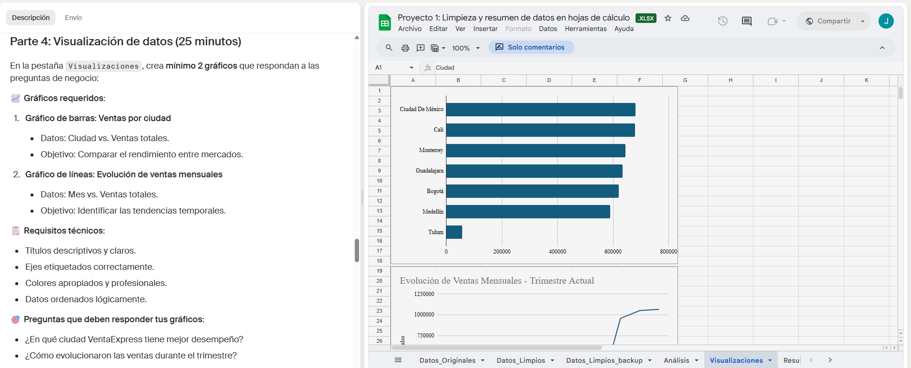
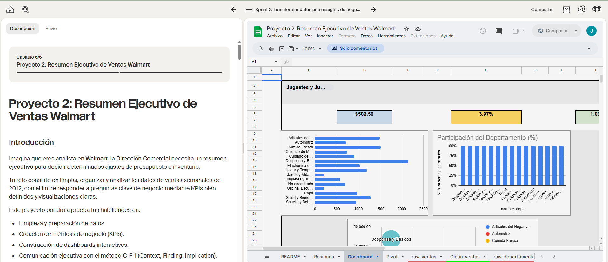
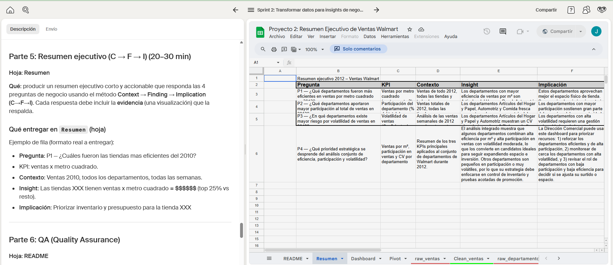

# Portafolio de Análisis de Datos

## Sobre mí

Soy Ingeniero en Sistemas Computacionales con enfoque en Data Analytics y Technology Risk, con experiencia práctica en desarrollo de soluciones dentro de un ERP.

Actualmente me estoy formando en análisis de datos mediante un bootcamp, donde he desarrollado habilidades en limpieza de datos, hojas de cálculo, análisis exploratorio, visualización de información y comunicación de hallazgos.

Mi objetivo profesional es desarrollarme en áreas relacionadas con análisis de datos, inteligencia de negocio, gobierno de datos, auditoría tecnológica y mejora de procesos mediante el uso estratégico de la información.

---

## Habilidades técnicas

- Limpieza y preparación de datos
- Análisis exploratorio de datos
- Manejo de hojas de cálculo
- Uso de fórmulas y funciones
- Identificación de datos duplicados y ausentes
- Estandarización de formatos
- Cálculo de métricas de negocio
- Creación de visualizaciones básicas
- Elaboración de informes ejecutivos
- Comunicación de hallazgos
- Pensamiento analítico orientado a negocio

---

## Proyectos

### Proyecto 1: Limpieza y resumen de datos en hojas de cálculo

#### Contexto del proyecto

Este proyecto simuló el trabajo de un analista de datos junior en VentaExpress, una empresa de comercio electrónico dedicada a la venta de productos tecnológicos como laptops, teléfonos, tablets y auriculares en distintas ciudades de México y Colombia.

El objetivo principal fue analizar los datos de ventas correspondientes al cuarto trimestre de 2024. La información original se encontraba en estado crudo, con problemas comunes en datasets reales, como formatos inconsistentes, valores duplicados, datos ausentes, columnas desorganizadas e información que necesitaba ser limpiada y estructurada.

#### Objetivo

Limpiar, organizar y analizar un conjunto de datos de ventas para extraer métricas clave, generar visualizaciones y presentar hallazgos útiles para la toma de decisiones estratégicas del negocio.

#### Herramientas utilizadas

- Google Sheets
- Funciones de hoja de cálculo
- Filtros
- Limpieza de datos
- Tablas de análisis
- Gráficos de barras
- Gráficos de líneas
- Informe ejecutivo

#### Proceso realizado

Durante el proyecto se trabajó con un archivo de ventas llamado `ventas_q4_2024_raw.csv`.

Primero se preservaron los datos originales en una pestaña separada para mantener una copia sin modificar. Después se creó una estructura de trabajo organizada en diferentes pestañas: datos originales, datos limpios, análisis, visualizaciones e informe ejecutivo.

En la etapa de limpieza se eliminaron registros duplicados, se aplicó formato de moneda a las columnas de precio unitario y monto total, se corrigieron los nombres de las ciudades utilizando formato consistente de mayúsculas y minúsculas, y se dividió la columna de producto en nuevas columnas de categoría, tipo y especificaciones.

También se identificaron valores ausentes en las columnas de precio unitario y monto total. Estos valores fueron tratados mediante cálculos derivados, utilizando la relación entre precio unitario, cantidad y monto total. De esta forma, se completó la información faltante sin eliminar registros útiles para el análisis.

Posteriormente, se calcularon métricas clave del negocio, como ventas totales del trimestre, venta promedio por transacción, número total de transacciones, categoría más vendida, ciudad con mayores ventas, mes con mejores resultados y precio promedio por categoría de producto.

Finalmente, se crearon visualizaciones para comunicar los principales hallazgos, incluyendo un gráfico de barras para comparar las ventas por ciudad y un gráfico de líneas para analizar la evolución mensual de las ventas durante el trimestre.

#### Análisis realizado

El análisis permitió responder preguntas importantes para VentaExpress, como qué ciudad tuvo mejor desempeño comercial, cómo evolucionaron las ventas durante el trimestre, cuál fue la categoría o producto con mayor demanda y qué comportamiento general mostraron las ventas en los distintos mercados.

Además, el proyecto permitió transformar datos desordenados en información clara, estructurada y útil para la toma de decisiones. La limpieza de datos fue una parte fundamental, ya que permitió asegurar que los cálculos y visualizaciones se basaran en información confiable.

#### Conclusiones principales

Este proyecto demostró la importancia de la limpieza y organización de datos antes de realizar cualquier análisis. Al corregir inconsistencias, eliminar duplicados y completar valores ausentes, fue posible generar métricas confiables y visualizaciones comprensibles.

También se reforzó la importancia de presentar los resultados de forma clara mediante un informe ejecutivo, ya que el valor del análisis no solo está en obtener números, sino en comunicar hallazgos relevantes para el negocio.

#### Habilidades desarrolladas

- Limpieza de datos en hojas de cálculo
- Identificación de duplicados
- Tratamiento de valores ausentes
- Estandarización de formatos
- Separación y transformación de columnas
- Cálculo de métricas de negocio
- Creación de visualizaciones básicas
- Comunicación de hallazgos en un informe ejecutivo

#### Evidencia visual

---

### Proyecto 2: Resumen Ejecutivo de Ventas Walmart

#### Contexto del proyecto

Este proyecto simuló el trabajo de un analista de datos en Walmart, donde la Dirección Comercial necesitaba un resumen ejecutivo para tomar decisiones relacionadas con presupuesto, inventario y desempeño comercial.

El análisis se enfocó en datos de ventas semanales de 2012, considerando información de tiendas, departamentos, ventas semanales, fechas, feriados, tipo de tienda y tamaño de tienda. El objetivo fue transformar datos crudos en información útil mediante limpieza, enriquecimiento, KPIs, tablas dinámicas, dashboard y comunicación ejecutiva.

#### Objetivo

Limpiar, organizar, enriquecer y analizar datos de ventas semanales para identificar qué departamentos fueron más eficientes en ventas por metro cuadrado y cuáles tuvieron mayor participación en las ventas totales del negocio.

#### Herramientas utilizadas

- Google Sheets
- Limpieza de datos
- BUSCARV / VLOOKUP
- Tablas dinámicas
- Campos calculados
- KPIs de negocio
- Validación de datos
- Dashboard interactivo
- Visualizaciones
- Formato condicional
- QA de datos
- Método C-F-I: Context, Finding, Implication

#### Datasets utilizados

El proyecto trabajó con tres tablas principales:

- `raw_ventas`: información transaccional de ventas semanales por tienda y departamento.
- `raw_departamento`: catálogo de departamentos y nombres correspondientes.
- `raw_tiendas`: información de tiendas, tipo de tienda y tamaño.

A partir de estas tablas se construyó una hoja limpia y enriquecida llamada `clean_ventas`, donde se integró la información necesaria para realizar el análisis.

#### Proceso realizado

Primero se realizó la limpieza de los datos de ventas, normalizando columnas como fecha y ventas semanales. Se verificó que las fechas tuvieran el formato correcto y que las ventas estuvieran expresadas en formato monetario.

Después se enriqueció la tabla principal mediante búsquedas con `BUSCARV`, agregando información adicional desde las tablas de tiendas y departamentos. Esto permitió incorporar variables como tipo de tienda, tamaño y nombre del departamento.

Posteriormente, se construyeron tablas dinámicas para calcular los principales KPIs del análisis. Entre ellos se incluyeron las ventas por metro cuadrado, utilizadas para medir eficiencia, y la participación del departamento sobre el total de ventas, utilizada para medir la relevancia comercial de cada área dentro del negocio.

También se creó un dashboard interactivo con un menú desplegable para seleccionar departamentos y visualizar automáticamente sus indicadores principales. El dashboard incluyó gráficos y valores dinámicos para facilitar la consulta de resultados por parte de usuarios directivos o stakeholders.

Finalmente, se elaboró un resumen ejecutivo utilizando el método C-F-I: contexto, hallazgo e implicación. Este método permitió comunicar los resultados de forma clara, breve y orientada a la toma de decisiones.

#### KPIs calculados

- Ventas por metro cuadrado.
- Participación del departamento sobre las ventas totales.
- Ventas semanales por departamento.
- Comparación de eficiencia entre departamentos.
- Indicadores dinámicos por departamento dentro del dashboard.

#### Análisis realizado

El análisis permitió evaluar la eficiencia comercial de los departamentos considerando no solo el volumen total de ventas, sino también el tamaño de las tiendas. Esto ayudó a identificar departamentos que podían generar altos ingresos de forma eficiente en relación con el espacio disponible.

También se analizó la participación de cada departamento dentro del total de ventas, permitiendo identificar cuáles aportaban más al negocio y cuáles podían estar por debajo de su potencial.

El uso de tablas dinámicas, campos calculados y dashboard permitió resumir grandes volúmenes de información en indicadores claros, facilitando la interpretación de resultados para perfiles ejecutivos.

#### Conclusiones principales

Este proyecto demostró la importancia de construir KPIs adecuados para responder preguntas específicas de negocio. No basta con conocer las ventas totales; también es necesario analizar la eficiencia, la participación y el comportamiento de los departamentos desde distintas perspectivas.

El dashboard permitió convertir el análisis en una herramienta práctica para la toma de decisiones, ya que los usuarios podían filtrar por departamento y consultar sus principales indicadores de manera dinámica.

Además, el uso del método C-F-I reforzó la importancia de comunicar hallazgos de forma ejecutiva, conectando el contexto del análisis con los resultados encontrados y sus posibles implicaciones para el negocio.

#### Habilidades desarrolladas

- Limpieza y preparación de datos
- Enriquecimiento de datos mediante tablas de referencia
- Uso de BUSCARV / VLOOKUP
- Construcción de KPIs
- Creación de tablas dinámicas
- Uso de campos calculados
- Diseño de dashboards interactivos
- Visualización de indicadores de negocio
- Validación de calidad de datos
- Comunicación ejecutiva de hallazgos
---

#### Evidencia visual

## Contacto
- **Linkedin:** [José Manuel Reyes Infante](https://www.linkedin.com/in/jose-manuel-reyes-infante-8a3a91331/)
- **Github:** [JoseReyesI](https://github.com/JoseReyesI)
- **Correo:** jose1496@live.com.mx 
